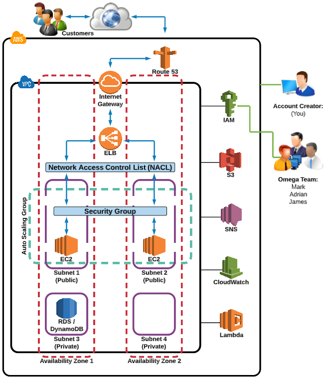
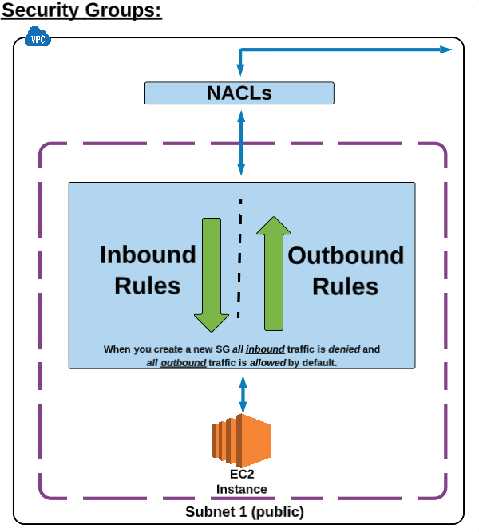
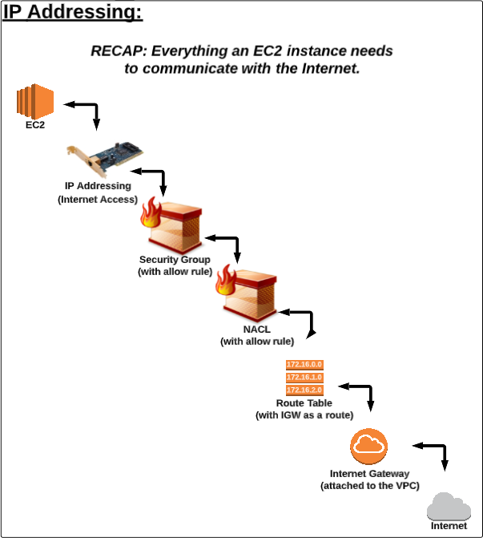

# AWS Essential

https://interactive.linuxacademy.com/diagrams/ProjectOmega2.html

### Internet Gateway (IGW) rules:

 - **One VPC** can only have **one Internet Gateway** attached.

 - An IGW cannot be detached from a VPC while there are active AWS resources in the VPC (such as an EC2 instance or RDS Database).

Route Table (RT) rules:

 - **A VPC** can have **multiple active route tables**;

 - A RT cannot be deleter if it has dependancies (associated subnets);

### NetACLS in AWS:

 - They are **stateless**;

 - **A subnet** can only be associated with **one NACL** at a time;

 - An NACL allows or denies traffic from entering a subnet. Once inside the subnet other AWS resourcer (i.e. EC2 isntances) may have additional security layers (security groups);

### Subnet in AWS:

 - A **VPC** spans **all of the Availability Zones in the region**.

 - A **Subnet** must reside entirely within **one Availability Zone** and cannot span zones;

 - **Public Subnets** have a route to the Internet - Controled via RT;

 - **Private Subnets** don't have a route to the Internet - Controled via RT;

 - If subnets are note explicitly associated with a Route Table, they will be **implicitly** associated with the **default Route Table**;

### Elastic Block Store (EBS):

 - Provides block level storage volumes for use with EC2 instances;
 - Can be attached to any running instance that is in the **same Availability Zone**;
 - They persist independently from the life of the instance;
 - EC2 instances:
     - Every EC2 instance **must have a root volume**, which may or not be EBS;
     - By default, **EBS root volumes are set to be deleted when the instance is terminated**;
 - Snapshots:
		 - An image of an EBS volume that can be **stored as a backup** or used to **create a duplicate**;
	 - It's not an active EBS volume and cannot be attached to an EC2 instance;
	 - To restore the snapshot, a new EBS volume must be created using the snapshot as a template;

### Security Groups

Differences between **NACLs** and **SGs**:

- **Network ACLs** apply at the **subnet level**, while **Security Groups** apply at the **Instance level**;
- **NACLs** have rule numbers, **SGs** don't;
- **NACLs** can have deny statements, **SGs** cannot;
- **NACLs** are **stateless**, while **SGs** are **stateful**;

New Security Groups allow **all traffic out** and **no traffic in**.

### EC2 to Internet Steps

### Simple Storage Service (S3)

This is AWS's primary storage service, where any type of file can be stored.

The root level "*folders*" in S3 are ***buckets***, which can have "*subfolders*" that are referred to as ***folders***.

Files stored in a bucket are referred to as ***objects***.

An S3 bucket is region specific, meaning all it's data and objects exist in a data center in that region. 

#### S3 Charging

Charging for S3 buckets is done in two ways:

1. **Storage Cost**
   - Applies to data at rest in S3;
   - Charged per GB used;
   - Price per GB varies based on region and storage class;
2. **Request Pricing** - moving data in/out of S3
   - PUT;
   - COPY;
   - POST;
   - LIST;
   - GET;
   - Lifecycle Transitions Request;
   - Data Retrieval;
   - Data Archival;
   - Data Restorartion;

#### S3 Properties

- **Bucket**
  - General Info
  - Permissions
  - Static Web Hosting
  - Logging
  - Events
  - Versioning
  - Lifecycle
  - Cross-Region Replication
  - Tags
  - Requester Pays
  - Transfer Acceleration
- **Folder**
  - General Info
  - Details
- **Object**
  - General Info
  - Details
  - Permissions
  - Metadata

#### S3 Storage Class

Represents the **classification** assigned to each object in S3.

This classification dictates things like:

- Storage cost
- Object availability
- Object durability
- Frequency of access

The default storage class is **standard**, but this can be changed at any time.

The available classes are:

- **Standard**
  - Designed for general, all-purpose storage;
  - Business critical objects and objects with frequent access;
  - Default storage option;
  - Most expensive class;
- **Intelligent-Tiering**:
  - Designed for objects with changing or uknown access patterns;
  - Access patterns of the objects are monitored, and those that haven't been accessed for some time, are moved to the infrequent access tier;
  - Less expensive than the standard storage class;
- **Standard-Infrequent Access**
  - Designed for objects that are not accessed frequently but must be immediately available when accessed;
  - S3 standard Infrequen Access;
  - Less expensive than the standard storage class;
  - But they do have a retrieval fee for acessing objects;
- **One Zone-Infrequent Access**
  - Designed for non-critical, reproducible objects;
  - Single Availability Zone;
- **Glacier**
  - Designed for long-term archival storage;
  - Useful for backup and compliance;
  - May take several hours for objects stored in Glacier to be retrieved;
  - Low-cost S3 storage class;
- **Glacier Deep Archive**
  - Designed for long-term archival storage;
  - Cheapest S3 storage class;

The change to Glacier may take one to two days to take effect

#### S3 Object Lifecycle

An object lifecycles is a set of rules that automate the migration of an object's to a different storage class, or its deletion, based on specified time intervals.

The lifecycle's functionality is located on the bucket level. However, it can be applied to:

- The entire bucket;
- One specific folder;
- One specific object;

#### S3 Permissions

S3 permissions grant granular control over who can view, access, and use specific buckets and objects.

They can be defined on the bucket and object level:

- **Bucket**
  - **List** - who can see the bucket name;
  - **Upload/Delete**
  - **Permissions**
- **Object**
  - **Open/Download**
  - **View**
  - **Edit**

Bucket level permissions are generally used for "internal" access control.

Objects can be shared via link.

#### S3 Versioning

Keeps track of and stores all versions of an object so that you can access and use an older version.

Versioning rules:

- It's either ON or OFF;
- Once it is turned ON, versioning **can only be suspended**, meaning it cannot be fully turned OFF;
- Suspending versioning **only prevents new versions**, while maintaining all previous versions in storage;
- Versioning can **only be set on the bucket level**, applying to all objects in the bucket;

### Databases

Two main categories of databases:

- Relational Databases, known as "*SQL*";
- Non-Relational Databases, known as "*NoSQL*";

AWS offers both:

- **RDS** for **SQL**;
- **DynamoDB** for **NoSQL**;

**RDS** is a **SQL database service** that provides a wide range of SQL database options.

**DynamoDB** is a **NoSQL database service**.

Differences between SQL and NoSQL:

- SQL
  - Stores related data in tables;
  - Typically used for very structured data, such as contact lists;
- NoSQL
  - Stores related data in JSON-like, name-value documents;
  - Typically used for non-structured data, such as cataloging documents;

### Pricing

Charging varies a bit between RDS and DynamoDB:

- RDS
  - The **engine choosen**;
    - **Amazon Aurora is not free**;
  - The **RDS Instance Class**;
    - Similar to EC2 instance type;
  - **Purchasing Terms**;
    - On Demand;
    - Reserved;
  - **Database Storage**;
  - **Data Transfer** in/out of RDS
- DynamoDB
  - **Provisioned Throughput Capacity**;
  - **Indexed Data Storage**;
  - **DynamoDB Streams**;
  - **Reserved Capacity**;
  - **Data Transfer** in/out of DynamoDB;