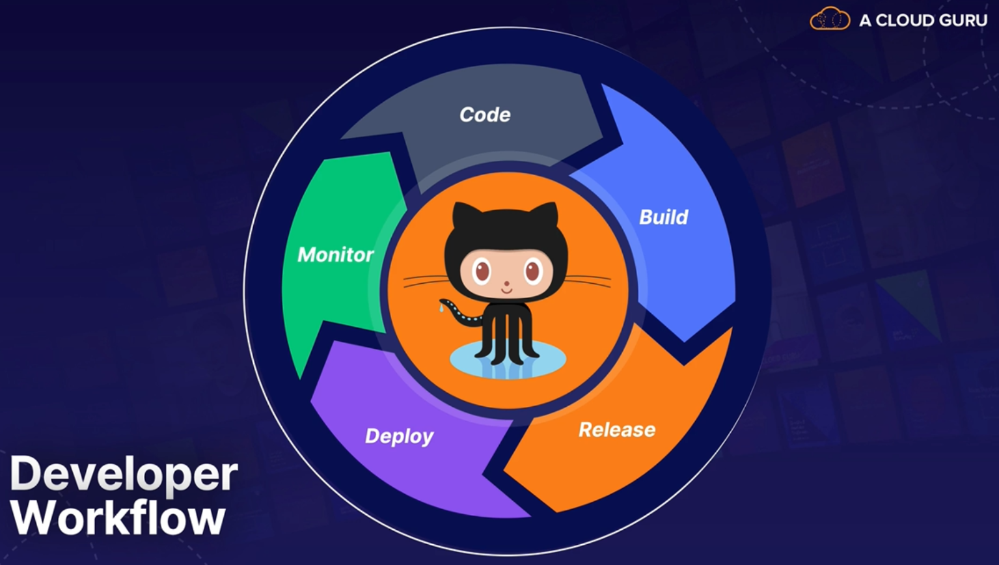

# Deployment Pipeline using GitHub Actions

## What is GitHub Actions?

### Why use GitHub Action?



To **automate** the **developer workflow** in order to focus more time on development.

This course will focus more on the **Build**, **Release** and **Deploy** stages of the *developer workflow*.

### CI Tools Available on GitHub

- **Multiple CI/Build Servers**:
  - These are called **Runners** in GutHub terms;
  - **Linux**, **MacOS** and **Windows** operating systems **supported**;
  - **Multiple execution strategies** available;
  - Get **live logs** as the build is running;
- **Test Multiple Versions**;
- **Trigger on any GitHub Event**:
  - Push, Pull-Request, ...;

The `.github/workflows/` path is the **default location** to place the **GitHub workflows**.


## Creating Your First GitHub Action

First thing to do was to spin up a **large** `CentOS w/ code-server` on the *ACG Cloud Servers* from the *Cloud Playground*. This server will be used as the **development server**.

The **VS Code Server** can be accessed by opening the url `https://$server_public_ip:8080`. The default password is: `CHANGE_THIS_PASSWORD`.

Once the server is up and running, do an *ssh* connection to it to install **NodeJS**.

```bash
# add the NodeSource yum repository to your system:
curl -sL https://rpm.nodesource.com/setup_14.x | sudo bash -

# install node.js 14.x and npm
sudo yum install -y nodejs

# check version of node and npm
node --version
npm --version
```

Once node is installed, setup a new package.

```bash
# Create a Node directory and an application directory
mkdir ~/node
mkdir ~/node/simplenodeapp

# Create the new Node project for simplenodeapp using the default parameters
cd ~/node/simplenodeapp
npm init
```

At this point, the project is created and you can open the folder `~/node/simplenodeapp` in the *Code-Server*.

To perform a simple test on the project, install **Mocha**.

```bash
cd ~/node/simplenodeapp
npm install mocha --save-dev
```

Now let's create the main **JavaScript** file:

```bash
cat << EOF | sudo tee ~/node/simplenodeapp/index.js
/*
 creates a server object in a variable named server
 takes in a request and response function
 outputs a response to the browser
 checks for the environment variable 'process.env.PORT`, or 5000 if not available
 then just output this string to the console
*/
const http = require('http');

const server = http.createServer((req, res) => {
    if (req.url === '/') {
        res.end('<h1>Hello, World</h1>');
    }
});

const PORT = process.env.PORT || 5000;

server.listen(PORT, () => console.log(`Server running on port ${PORT}`));

EOF
```

Let's also create a test file for using with *GitHub Action*:

```bash
cat << EOF | sudo tee ~/node/simplenodeapp/test.js
const assert = require('assert');
describe('Simple Math Test', () => {
 it('should return 2', () => {
        assert.equal(1 + 1, 2);
    });
 it('should return 9', () => {
        assert.equal(3 * 3, 9);
    });
});

EOF
```

With this done, let's **push** this information to the GitHub Repo so we can start using GitHub Actions:

```bash
# add gitignore
echo "node_modules" > .gitignore

# initialize git repo
git init

# add remote origin
# add the ssh version if you have the ssh keys already configured
git remote add origin https://github.com/<your github username>/<repo name>.git

# set global configs
git config --global user.email "email@example.com"
git config --global user.name "myusername"
git config --global init.defaultBranch main

# add tracked files
git add .

# commit changes
git commit -m "Initial commit"

# push to master
git push origin main
```

With the code now in GitHub we can start creating the Actions:

- Open the *Actions* tab in your repository;

- Select the **Node.js** *Workflow*;

- Leave everything as default and commit the new file;

- At this point, a new *Workflow* just started executing to build the Node code;


## Creating JavaScript GitHub Actions

### Lab Overview

1. **Two Types of Actions**:

  - JavaScript actions;

  - Container actions;

2. **Learn about Creating Action YAML files**;

3. **Create a Custom JS Action YAML**;


#### JavaScript vs. Container Actions

The main differences between there are:

- **JavaScript**:

  - **Run directly** on the CI server/build agent/runner;

  - **External dependencies must be pre-installed**;

  - Support for TypeScript;

  - **All OS supported**;

- **Container**:

  - **Portable** and **flexible**;

  - **Consistent** and **reliable**;

  - **Customize Os and tools**;

  - **Slower** that JS actions;

  - **Linux only**;

### Lab Steps

#### Create the GitHub Action

First, fork the [JavaScript action template repo](https://github.com/linuxacademy/content-javascript-actions-app.git) to your own repository.

Afterwards, clone the repo and initialize the project using the package.json file:

```bash
# clone the repo
git clone https://github.com/$YOUR_GITHUB_ACCOUNT/content-javascript-actions-app.git ~/content-javascript-actions-app

# initialize the project
cd ~/content-javascript-actions-app
npm init -y
```

Then create the GitHub action file:

```yaml
# ~/content-javascript-actions-app/action.yaml
name: 'Hello World'
description: 'Greet someone and record the time'
inputs: # input parameters are stored as environment variables
  who-to-greet:  # id of input
    description: 'Who to greet'
    required: true
    default: 'World'
outputs:
  time: # id of output
    description: 'The time we greeted you'
runs:
  using: 'node12'
  main: 'index.js'
```

With action created, let's install the actions toolkit:

```bash
# the @actions/core package provides an interface to the commands in the workflow and helps with input and output variables
npm install @actions/core

# the @actions/github package returns the Octokit REST client and GitHub actions contexts
npm install @actions/github
```

Now that that is done, let's create the main JS file:

```javascript
/* 
 ~/content-javascript-actions-app/index.js

 prints hello $person in a debug message in the log
 the script gets the current time and sets it as an output variable for our action to use
 GitHub Actions provide context information about the webhook event, Git refs, workflow, action, and the person who triggered the workflow
*/
const core = require('@actions/core');
const github = require('@actions/github');

try {
  // `who-to-greet` input defined in action metadata file
  const nameToGreet = core.getInput('who-to-greet');
  console.log(`Hello ${nameToGreet}!`);
  const time = (new Date()).toTimeString();
  core.setOutput("time", time);
  // Get the JSON webhook payload for the event that triggered the workflow
  const payload = JSON.stringify(github.context.payload, undefined, 2)
  console.log(`The event payload: ${payload}`);
} catch (error) {
  core.setFailed(error.message);
}
```

With the code finished, let's send it to the repo and **create a tag** to mark the version of the action:

```bash
git add .
git commit -m "My first action"
git tag -a -m "My first action release" v1
git push --follow-tags
```
#### Create a Private Workflow

Inside the same repo, create a new workflow file and paste the following content:

```yaml
# ~/content-javascript-actions-app/.github/workflows/main.yaml
on: [push]

jobs:
  hello_world_job:
    runs-on: ubuntu-latest
    name: A job to say hello
    steps:
      # To use this repository's private action,
      # you must check out the repository
      - name: Checkout
        uses: actions/checkout@v3 # This action checks-out your repository under $GITHUB_WORKSPACE, so your workflow can access it.
      - name: Hello world action step
        uses: ./ # Uses an action in the root directory
        id: hello
        with:
          who-to-greet: 'Pedro Coelho'
      # Use the output from the `hello` step
      - name: Get the output time
        run: echo "The time was ${{ steps.hello.outputs.time }}"
```

Send this workflow to the repo and watch the action run.

```bash
git add .github/*
git commit -m "Added private workflow"
git push
```


## Creating Container GitHub Actions

### Lesson Overview

1. **Container Actions Overview**

  - What they are;

  - How are they used;

  - When to use them over JS actions;

2. **Build a Container Action**

### Container Actions

Uses a **container** to run the action, instead of the *Runner* server.

Particularities of using container actions:

- They allow you to **package the environment** to make running the action easier and consistent;

- They **allow for specifying a Linux distro** and including dependencies;

  - Git hub does specify that the **prefered Linux distro is Debian**

- Good for **custom environment configurations**;

  - Since everything is specified inside the container's file;

