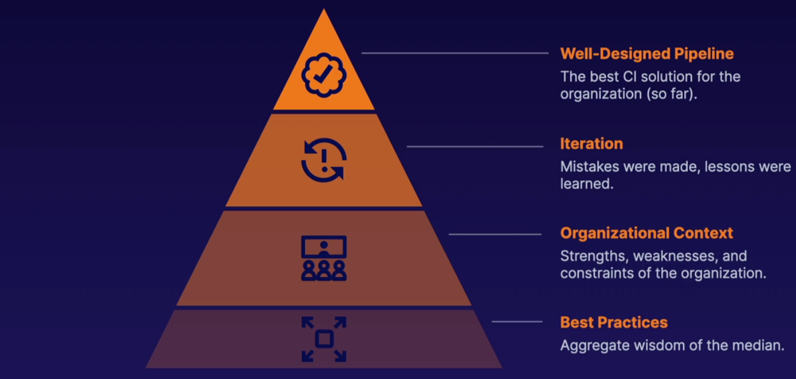

# GitHub Actions Deep Dive

## GitHub Custom Runners

A **custom GitHub runner** is:

- A **VM** where jobs defined in a **workflow are run**;
- It can be Linux, Windows, or Mac;
- It can run in a **cloud**, **data center** , or a local **workstation**;
- You're responsible for **security**, **patching**, and **updates** on custom runners;

### Why use Custom Runners

1. **Hosting a GitHub instance**;
2. **Security**
   1. **Manage access to secrets**;
   2. **Security monitoring requirements**;
3. **Cost Management**
   1. Pay for what you use, and not per-minute;

## Securing GitHub Actions

Since GitHub actions is a managed service, securing workloads and runners will look different than a traditional hardening solution.

The public access that makes GitHub so collaborative also offers attackers plenty of points of entry.

### Untrusted Inputs

Workflows can be designed to trigger or evaluate pull requests, comments, issues, and other public contributions.

However, these sources can be used to **inject malicious code** that can **compromise secrets**, **disrupt workflows**, and otherwise **harm the project**.

When working with public repositories, **be wary of automated builds of untrusted code**.

### Community Actions

As like any other Open Source tool, they can be trusted, but they must be verified.

If using a GitHub organization, GitHub allows you to restrict approved actions in the organization's repos.

GitHub actions can also be forked and maintained like any other repo, allowing for maintaining the action in an approved state only.

### Custom Runners

Using custom runners with public repos can be dangerous. One example of this is **running untrusted code** in the custom runner, **inside your environment**.

Some recommendations here are:

- GitHub managed runners might be a safer investment in security than using custom runners;
- Manage runner permissions, both on the VM and in the larger environment;
- Consider separate runners for each repo so that if a repo is compromised, it is isolated;

## General GitHub Security Practices

- **Is the repository public? Does it need to be?**
  1. **Tradeoff between larger feedback** and the **least privilege** principle;
- **Are the key branches** (main, dev) **protected?**
  - protected from someone accidentally pushing to these branching and triggering code deployments;
- **Do you have the correct approvers for PRs? Multiple approvers?**
  - To prevent that someone can singlehandedly push code to a customer facing branch without a second pair of eyes;
- **Is the principle of least privilege being applied to secrets?**
  - Do any workflows have access to secrets they don't need?

https://securitylab.github.com/research/github-actions-untrusted-input/

## Designing Workflows and Pipelines

### The CI Piramid

### Focus on Value

CI's focus needs to be to add value and not on best practices by themselves.

Some ways that CI can add value are:

- **Faster Iteration**
  - help identify problems and build PoC faster so fewer resources are invested in dead ends;
- **Fewer Errors**
  - Automating build and test processes should reduce human error;
- **Less Toil**
  - Automation frees engineers to focus on higher value tasks;

### Managing Pipelines at Scale

In larger organizations, sometimes a Shared Services or DevOps team is responsible for CI pipelines.

When there are too many applications for the number of CI engineers two viable options are:

- **Maintain a Few Standard Pipelines**
  - Helps reduce workload, but pipelines will not be optimized for every application;
- **App Teams Design Custom Pipelines**
  - Pipelines are optimized for the application, but app teams need to have CI knowledge;

### Structuring Pipelines

#### Job Size

Jobs can be large or small, and steps can be grouped into as few or as many jobs as needed.

Advantages of using:

- **Several Small Jobs**
  - **Flexibility**
    - Easy to run in parallel and reorder as needed;
  - **Customizability**
    - Only need the tools for a specific function;
  - **Quickly Resume**
    - Restart failed jobs without restarting the entire pipeline;
- **Few Large Jobs**
  - **Not Managing Artifacts**
  - **Less Variance**
    - Common tools are installed once;
  - **Migrating from script**
    - Simpler to convert a single makefile or script into a pipeline;

### Branching Strategy

Some considerations to have regarding branching:

- **What branches are needed?**
- **How often should releases happen?**
- **Protect the key branches**

## Building you Code

### Triggering a Workflow

A workflow can be triggered in a variety of ways. The most common ones are:

- Push;
- Pull Request;
- Schedule;

Other ones include: Issues; Releases; and more;

### Creating the Workflow File

### Building in Workflows

### Environment Variables

### Steps Breakdown