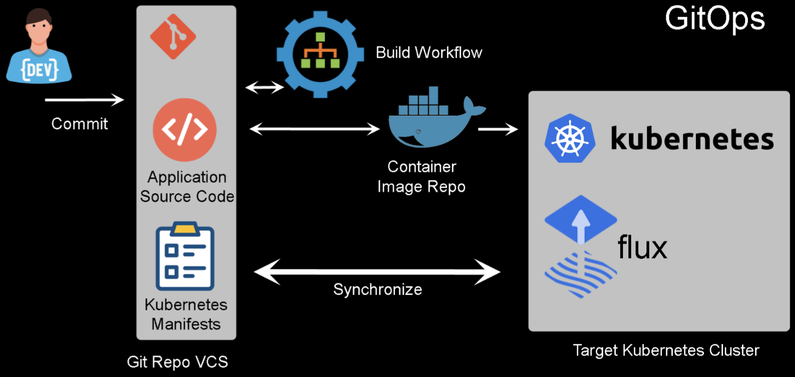

# Hands-On GitOps

## DevOps with GitOps


### DevOps workflow:

1. **Coding Loop** (Left Circle);
   1. **Planning** the application;
   2. **Coding** the application;
   3. **Building** the application (building, compiling or containerizing the code);
2. **Code exits Sprint**;
   1. **Continuous Quality** checks on the code;
      1. Testing the code and the infrastructure it will reside in;
   2. **Release Gating** checks if the code is ready and compliant to move from one stage to the next;
      1. From Dev to Test, from Test to Pre-Prod and from Pre-Prod to Prod (other stages may exist);
   3. **Continuous Delivery** is performed if the code is valid by maintaining it in a deployable state;
   4. **Automated Deployment** happens by taking the prepared code and deploying to production
3. **Infrastructure Loop** (Right Circle);
   1. A **Continuous Monitoring** of the code and infrastructure is performed to check on the status;
   2. **KPI Feedback** comes from this *Continuous Monitoring* to see if the minimum, desired or critical values for our code and infrastructure are being meet;
4. **Info from Prod**;
   1. With the information gathered in production, **Continuous Improvements** can be performed on the code and the infrastructure;

#### GitOps place in the DevOps Workflow

In order to assist in doing **Automated Deployment** and **Continuous Deployment**, the GitOps practice takes code and workloads from version control and synchronizes the environments, with what is being maintained in the repositories.


### GitOps Architecture used on this Course



Presented above is the architecture used in this GitOps course. The main workflow and components look like this:

1. The **Code Developer** or **Operations Engineer** create code;
2. This code is then store in a **Version Control System** using **Git**;
   - The *Code Developers* will write the **application source code**;
   - The *Operations Engineer* will write the **infrastructure source code** in **Kubernetes Manifests** (YAML files);
3. The *application source code* will be **Built** in to a **Container Image** that will be stored in **Docker Hub**;
4. A **Kubernetes Cluster** will be used to run the **Workloads**;
   - This *Cluster* will be the **Infrastructure** where the *application container* will run in;
5. **Flux** will be installed inside the *Kubernetes Cluster* and will pay attention to the *VCS Repo*;
   1. *Flux* will use the *builded code* to create the **Kubernetes Pods**;
   2. And the *Kubernetes Manifests* to create the **Kubernetes Deployments, Services, Service Accounts** and whatever other configuration that needs to be performed on the infrastructure;
6. *Flux* will do this by **monitoring the VCS Repo** for any **Commits**, **Pushes** and **Push Requests** that are being performed;


## Labs

### Installing and Configuring Flux with GitHub

#### Introduction

This lab introduces the steps necessary for installing Flux and configuring it to work with a repository in GitHub. We'll need our own GitHub account to fork a sample repository, and this lab will spin up a Kubernetes cluster to enable us to install and configure Flux.

#### Create a GitHub Repository

The [ACloudGuru-Resources/content-gitops](https://github.com/ACloudGuru-Resources/content-gitops) repository is already online for us. Let's get into it and press the **Fork** button. Once the new repository is created, we'll use the credentials on the hands-on lab overview page to log into our Kubernetes master node as `cloud_user`.

#### Deploy Flux Into Your Cluster

Let's make sure Kubernetes is running, and that we have some nodes:

```
$ kubectl get nodes 
```

Now let's make sure Flux is installed and running:

```
$ fluxctl version 
```

We should get response of *unversioned*, which is fine. Now let's take another look at our Kubernetes deployment:

```
$ kubectl get pods --all-namespaces 
```

Create a namespace for Flux:

```
$ kubectl create namespace flux 
```

This will let us make sure it got created:

```
$ kubectl get namespaces 
```

Set the GHUSER environment variable, then check to make sure it was set:

```
$ export GHUSER=[Our GitHub Handle] $ env | grep GH 
```

Now we can deploy Flux, using the `fluxctl` command:

```
$ fluxctl install \ --git-user=${GHUSER} \ --git-email=${GHUSER}@users.noreply.github.com \ --git-url=git@github.com:${GHUSER}/content-gitops \ --git-path=namespaces,workloads \ --namespace=flux | kubectl apply -f - 
```

#### Verify The Deployment and Obtain the RSA Key

Once that `fluxctl` command is finished running, we can verify:

```
$ kubectl get pods --all-namespaces $ kubectl -n flux rollout status deployment/flux 
```

Now we can get the Flux RSA key created by `fluxctl`:

```
$ fluxctl identity --k8s-fwd-ns flux 
```

Copy that RSA key, and let's head back over to GitHub.

#### Implement the RSA Key in GitHub

In the GitHub user interface, make sure we're in our new repository and click on the **Settings** tab. In there, click **Deploy keys**, then click the **Add deploy key** button. We can give it a *Title* of something like **GitOps Deploy Key**, then paste the key we copied earlier down in the *Key* field. Check the *Allow write access* box, and then click **Add key**.

#### Use the `fluxctl sync` Command to Synchronize the Cluster with the Repository

Use `fluxctl` to sync the cluster with the new repository:

```
$ fluxctl sync --k8s-fwd-ns flux 
```

Then check the existence of the *lasample* namespace:

```
$ kubectl get namespaces 
```

Then check that the Nginx deployment is running:

```
$ kubectl get pods --namespace=lasample 
```

We should see the deployment running, with two replicas.


### Operating and Troubleshooting Flux in a Kubernetes Cluster