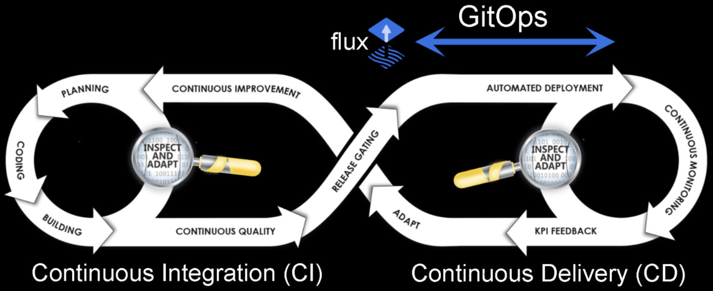

# Hands-On GitOps

## DevOps with GitOps

### DevOps workflow:

1. **Coding Loop** (Left Circle);
   1. **Planning** the application;
   2. **Coding** the application;
   3. **Building** the application (building, compiling or containerizing the code);
2. **Code exits Sprint**;
   1. **Continuous Quality** checks on the code;
      1. Testing the code and the infrastructure it will reside in;
   2. **Release Gating** checks if the code is ready and compliant to move from one stage to the next;
      1. From Dev to Test, from Test to Pre-Prod and from Pre-Prod to Prod (other stages may exist);
   3. **Continuous Delivery** is performed if the code is valid by maintaining it in a deployable state;
   4. **Automated Deployment** happens by taking the prepared code and deploying to production
3. **Infrastructure Loop** (Right Circle);
   1. A **Continuous Monitoring** of the code and infrastructure is performed to check on the status;
   2. **KPI Feedback** comes from this *Continuous Monitoring* to see if the minimum, desired or critical values for our code and infrastructure are being meet;
4. **Info from Prod**;
   1. With the information gathered in production, **Continuous Improvements** can be performed on the code and the infrastructure;

#### GitOps place in the DevOps Workflow

In order to assist in doing **Automated Deployment** and **Continuous Deployment**, the GitOps practice takes code and workloads from version control and synchronizes the environments, with what is being maintained in the repositories.

