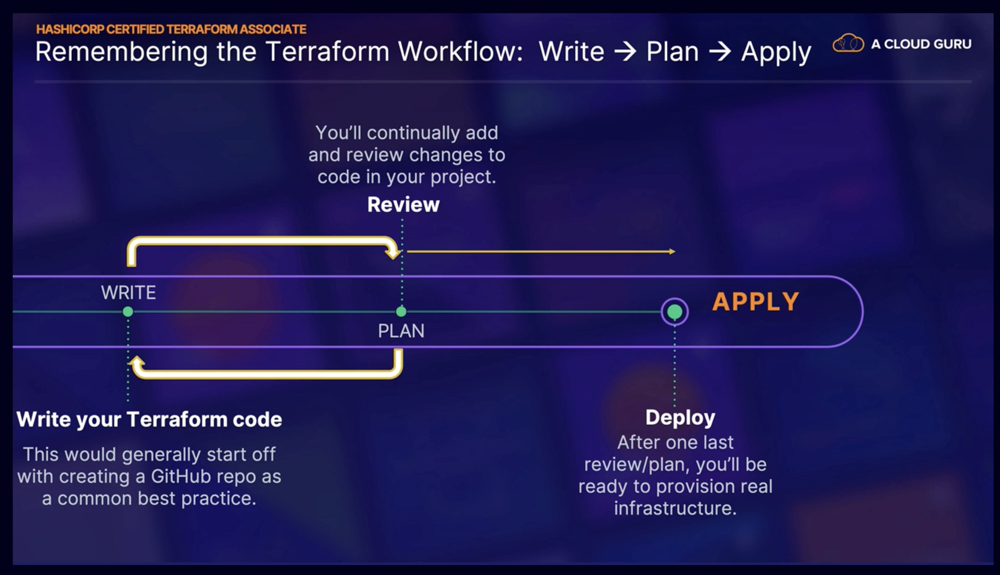

# Hashicorp Certified Terraform Associate

## Introduction

## What Is Terraform

## IaC with Terraform

### Terraform Workflow

### Terraform init

The `terraform init` command initializaes the working directory that contains your Terraform code.

Steps that it takes:

- **Downloads ancillary components**
  - Downloads providers, modules and plugins
- **Sets up the backend**
  - Backend for storing the **Terraform state file**, a mechanism by which Terraform tracks resources

### Terraform Key Concepts: Plan, Apply and Destroy

**terraform plan** (Review Stage):

- Reads the code and then creates and shows a "plan" of execution/deployment
- Allows the user to "review" the action plan before executing anything
- At this stage, authentication credentials are used to connect to your infrastructure, if required

**terraform apply** (Deploy Stage):

- Deploys the instructions and statements in the code
- Updates the deployment state tracking mechanism file, a.k.a. "state file"

**terraform destroy**:

- Looks at the recorded, stored state file created during deployment and destroys all resources created by your code
- Non-reversible command

